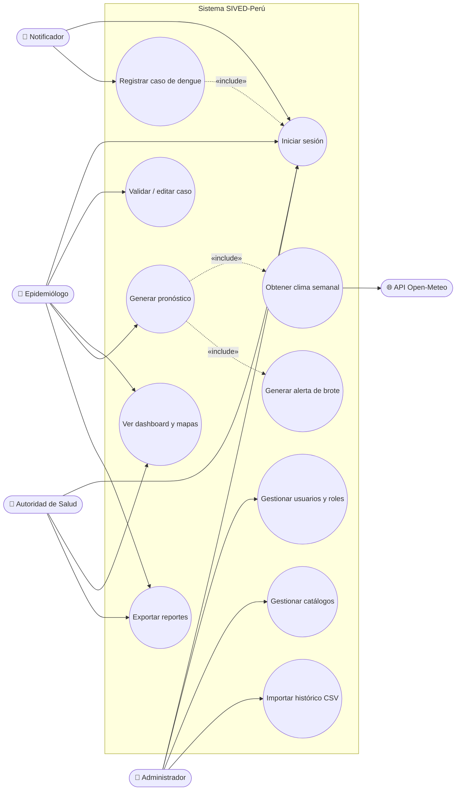
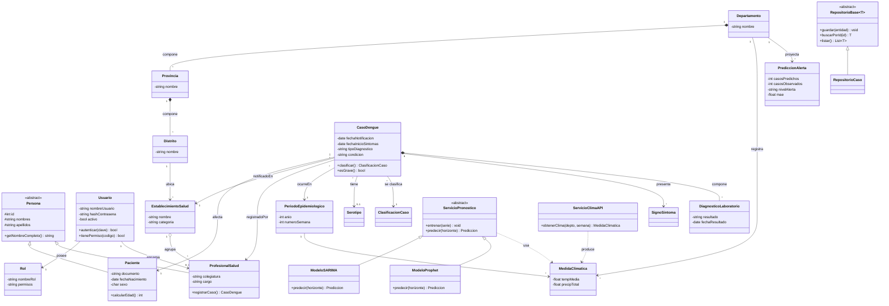
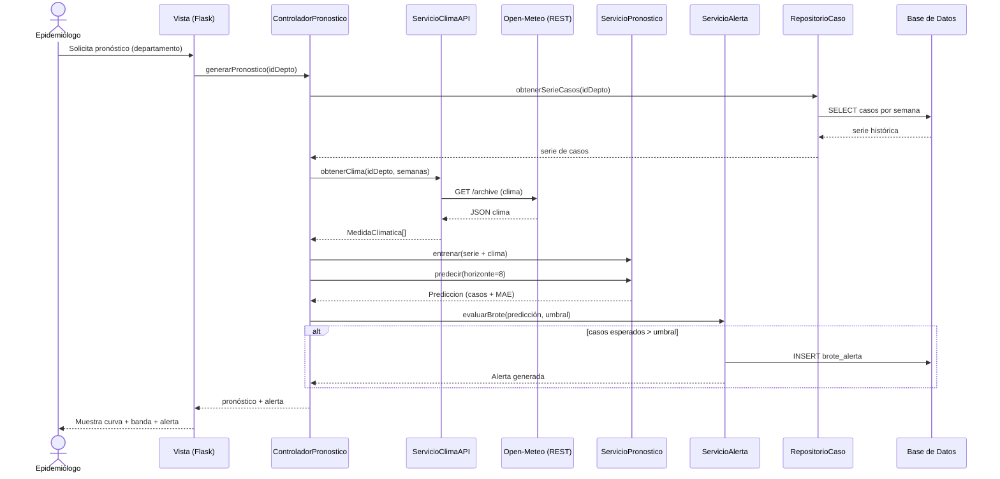
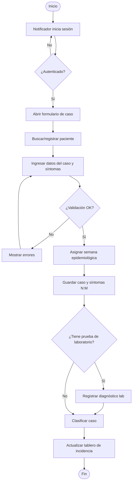
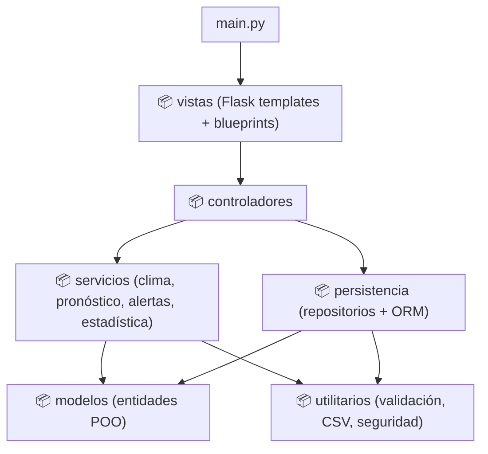

# 🧩 Capítulo III — Modelamiento UML

> Diagramas en **Mermaid** (se renderizan en Obsidian con *Mermaid* activo). Sistema **SIVED-Perú**.
> Cubre los 5 diagramas obligatorios del PDF: Casos de Uso, Clases, Secuencia, Actividades, Paquetes.

## 3.1 Diagrama de Casos de Uso

## 3.2 Diagrama de Clases

> Demuestra los 7 requisitos POO del PDF. Mapa de conceptos al final.

> [!check] Mapa de conceptos POO (rúbrica)
> | Concepto | Dónde |
> |---|---|
> | **Clases y objetos** | Todas las entidades (`CasoDengue`, `Paciente`, …) |
> | **Encapsulamiento** | Atributos `-private` / `#protected` con getters/métodos |
> | **Asociación** | `CasoDengue → Paciente`, `Usuario → Rol` |
> | **Agregación** | `EstablecimientoSalud o-- ProfesionalSalud` (el profesional existe sin el EE.SS.) |
> | **Composición** | `Departamento *-- Provincia *-- Distrito`; `CasoDengue *-- DiagnosticoLaboratorio` |
> | **Herencia** | `Persona → Paciente/ProfesionalSalud`; `ServicioPronostico → SARIMA/Prophet`; `RepositorioBase → RepositorioCaso` |
> | **Polimorfismo** | `predecir()` redefinido en `ModeloSARIMA`/`ModeloProphet`; repositorios genéricos |

## 3.3 Diagrama de Secuencia — *Generar pronóstico y alerta*

## 3.4 Diagrama de Actividades — *Registrar notificación de caso*

## 3.5 Diagrama de Paquetes (arquitectura por capas)

> [!note] Diagramas opcionales
> Se pueden añadir **Componentes** y **Despliegue** (navegador → servidor Flask → PostgreSQL → API Open-Meteo) en la entrega final.

🔗 [[08 - Cap II - Analisis (Dengue)]] · [[10 - Cap IV - Diseno de Base de Datos (Dengue)]]
