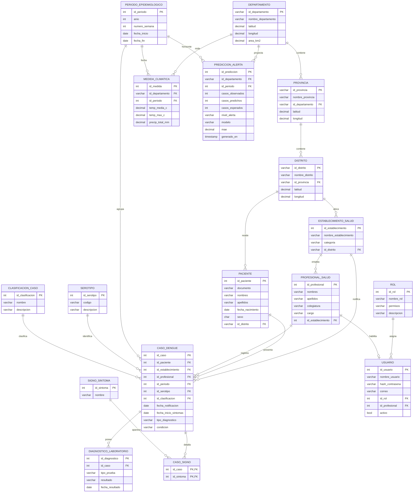

# 🗄️ Capítulo IV — Diseño de Base de Datos

> Sistema **SIVED-Perú**. Gestor objetivo: **PostgreSQL** (o MySQL). **17 tablas** relacionadas con integridad referencial (supera el mínimo de 15 del PDF).

## 4.1 Modelo Entidad-Relación

## 4.2 Inventario de tablas (17)

| # | Tabla | Tipo | Origen de datos |
|---|---|---|---|
| 1 | `departamento` | Dimensión geográfica | ✅ real (COD-AB) |
| 2 | `provincia` | Dimensión geográfica | ✅ real |
| 3 | `distrito` | Dimensión geográfica | ✅ real |
| 4 | `establecimiento_salud` | Dimensión | ⚙️ sintético s/ distritos reales |
| 5 | `profesional_salud` | Dimensión | operativo |
| 6 | `paciente` | Dimensión | operativo (anonimizado) |
| 7 | `periodo_epidemiologico` | Dimensión temporal | ✅ real (derivado) |
| 8 | `serotipo` | Catálogo | catálogo OMS |
| 9 | `clasificacion_caso` | Catálogo | catálogo OMS |
| 10 | `caso_dengue` | **Hecho central** | operativo (+ histórico real) |
| 11 | `signo_sintoma` | Catálogo | clínico |
| 12 | `caso_signo` | Asociativa N:M | operativo |
| 13 | `diagnostico_laboratorio` | Detalle/composición (incluye `tipo_prueba`) | operativo |
| 14 | `medida_climatica` | Hecho | ✅ real (Open-Meteo) |
| 15 | `prediccion_alerta` | Hecho (salida IA + alerta de brote) | generado por el modelo |
| 16 | `usuario` | Seguridad | operativo |
| 17 | `rol` | Seguridad (permisos por rol) | operativo |

## 4.3 Reglas de integridad
- **PK** en todas las tablas; **clave compuesta** en `caso_signo` (`id_caso`, `id_sintoma`).
- **FK** con `ON DELETE RESTRICT` en catálogos y `ON DELETE CASCADE` en `diagnostico_laboratorio` y `caso_signo` respecto a `caso_dengue`.
- **Dominios**: `sexo ∈ {M,F}`, `condicion ∈ {Vivo, Fallecido}`, `tipo_diagnostico ∈ {Probable, Confirmado}`, `tipo_prueba ∈ {NS1, IgM, RT-PCR}`, fechas con `fecha_inicio_sintomas ≤ fecha_notificacion`.
- **Índices** sobre FK y sobre (`id_periodo`, `id_departamento`) para acelerar el dashboard.
- **Seguridad por rol**: los permisos se modelan como atributo `permisos` de `rol` (no requiere tablas extra).

> [!note] Relación con los datasets reales
> El histórico real de OpenDengue está **agregado por provincia/semana** → se carga en una vista/tabla analítica derivada de `caso_dengue` (o directamente en el dashboard). El CRUD opera sobre **notificaciones individuales**; el clima real (`medida_climatica`) y la geografía son cargas directas de los CSV de [[07 - Datasets (3 Ganadores)]].

🔗 [[08 - Cap II - Analisis (Dengue)]] · [[09 - Cap III - Modelamiento UML (Dengue)]] · [[11 - Contexto de Resultados (Dengue)]]
